# CLAUDE.md — innovation 项目工作区

> 生成时间: 2026-05-14 | 更新: 2026-05-14 | 扫描模式: 模块优先扫描 | 截断: 否

## 项目愿景

本项目（"innovation"工作区）是一个围绕**太空原生网络（Space-Native Networking, SNN）**的学术研究集合。核心命题是：经典地面网络理论（香农信息论 + TCP/IP 协议栈）的三大隐式假设——空间静态性、拓扑平稳性、能量充裕性——在太空环境下集体坍塌，必须从第一性原理重构网络理论。

项目产出的核心文献《太空原生网络：一种统一的时空信息论》提出了基于三大公理（时空嵌入 A1、拓扑过程 A2、能量闭合 A3）的统一框架，推导了四个核心极限定理（T1 时空容量上界、T2 动态连通概率下界、T3 能量-延迟最优性界、T4 STIR 统一定理）和不可扩展性定理（T5），并设计了"太空原生协议栈"（五层架构，核心机制为测地线调度 Geodesic Scheduling）。

围绕核心理论，项目扩展了 9 个子方向的研究论文，涵盖：干扰受限容量界、渗流连通性、DRL 能量感知调度、量子密钥分发、预测性路由协议、通感算轨一体化（ISACC）、信息-动力耦合编队控制、不可扩展性实证研究、以及时空网络演算（STNC）。

## 架构总览

```
C:\Users\lyr\Desktop\innovation\          # 项目根
├── references/                            # 6 篇参考论文 (PDF)
│   ├── 太空原生网络：一种统一的时空信息论.pdf      # ← 核心文献
│   ├── 星地融合网络：一体化模式、用频与应用展望_张世杰.pdf
│   ├── 低轨卫星通信遥感融合：架构、技术与试验_彭木根.pdf
│   ├── 全球泛在连接新模式：手机直连卫星关键技术及挑战_何元智.pdf
│   ├── 基于随机几何的低轨星座下行通信链路仿真与分析_梁国鑫.pdf
│   └── 天地一体化新路径：手机直连卫星发展热点、挑战与关键技术_何元智.pdf
│
├── extracted_text/                        # 参考论文文本提取 (TXT)
│   └── 6 个 .txt 文件（与 references/ PDF 对应）
│
├── drafts/                                # 10 篇研究论文初稿 (.docx)
│   ├── 00_三大核心观点总结.docx              # ← 入门必读
│   ├── 01_干扰受限场景下的紧致时空容量界研究.docx
│   ├── 02_基于连续渗流理论的太空原生网络精确连通概率分析.docx
│   ├── 03_基于深度强化学习的太空原生网络能量感知调度算法.docx
│   ├── 04_面向卫星量子密钥分发的时空信息场理论扩展.docx
│   ├── 05_基于时空测地线的太空原生网络预测性路由协议设计.docx
│   ├── 06_通感算轨一体化网络资源联合优化理论与算法.docx
│   ├── 07_基于信息动力耦合的卫星编队自主组网控制理论.docx
│   ├── 08_大规模LEO星座中地面网络范式不可扩展性的实证研究.docx
│   └── 09_太空原生网络中的时空网络演算理论.docx
│
├── revised_drafts/                        # 3 篇已修订论文 (.docx)
│   ├── A_基于深度强化学习的太空原生网络能量感知调度算法.docx  # 修订自 draft 03
│   ├── B_基于时空测地线的太空原生网络预测性路由协议设计.docx  # 修订自 draft 05
│   └── C_大规模LEO星座中地面网络范式不可扩展性的实证研究.docx # 修订自 draft 08
│
├── scripts/                               # 论文工具脚本
├── simulation/                            # 仿真原型与路由实验脚本
│   ├── create_papers.py                   # 论文批量生成 (1篇总结 + 8篇初稿)
│   ├── refine_revised_papers.py           # 论文修订 (XML级段落替换)
│   ├── rewrite_selected_papers.ps1        # 重写3篇论文
│   ├── enhance_selected_papers.ps1        # 论文增强
│   ├── fix_05_intro.ps1                   # 修复论文05引言
│   ├── repair_incomplete_paragraphs.ps1   # 修复不完整段落
│   ├── _verify_docs.ps1                   # 文档质量验证
│   ├── launch claude.bat                  # Claude CLI 启动器
│   └── launch codex.bat                   # Codex CLI 启动器
│
├── CLAUDE.md                              # 本文件 - AI上下文
└── .claude/                               # Claude 内部文件
```

## 模块结构图

```mermaid
graph TD
    A["(根) innovation 工作区"] --> B["references/"];
    A --> C["extracted_text/"];
    A --> D["drafts/"];
    A --> E["revised_drafts/"];
    A --> F["scripts/"];
    A --> G["simulation/"];

    B --> B1["核心文献: 太空原生网络"];
    B --> B2["星地融合/通信遥感/手机直连"];

    C --> C1["6个PDF文本提取文件"];

    D --> D0["00 三大核心观点总结"];
    D --> D1["01-02 容量界/连通性"];
    D --> D3["03 DRL能量感知调度"];
    D --> D4["04 量子密钥分发"];
    D --> D5["05 预测性路由协议"];
    D --> D6["06 ISACC通感算轨"];
    D --> D7["07 信息动力耦合"];
    D --> D8["08 不可扩展性实证"];
    D --> D9["09 时空网络演算"];

    E --> E1["A 修订: DRL调度"];
    E --> E2["B 修订: 路由协议"];
    E --> E3["C 修订: 不可扩展性"];

    F --> F1["Python: 论文生成/修订"];
    F --> F2["PowerShell: 重写/增强/验证"];
    F --> F3["BAT: CLI启动器"];

    click B "./references/" "查看参考论文目录"
    click C "./extracted_text/" "查看文本提取目录"
    click D "./drafts/" "查看论文初稿目录"
    click E "./revised_drafts/" "查看修订稿目录"
    click F "./scripts/" "查看论文工具脚本目录"
    click G "./simulation/" "查看仿真脚本目录"
```



## 模块索引

| 模块路径 | 格式 | 职责描述 | 入口/核心文件 | 说明文档 |
|----------|------|----------|---------------|----------|
| `references/` | PDF | 6 篇参考论文，提供理论基础与领域背景 | `太空原生网络：一种统一的时空信息论.pdf` | `references/说明.md` |
| `extracted_text/` | TXT | 参考论文 PDF 的文本提取（6 篇） | `太空原生网络：一种统一的时空信息论.txt` | `extracted_text/说明.md` |
| `drafts/` | DOCX | 10 篇研究论文初稿（1篇总结 + 9篇专题） | `00_三大核心观点总结.docx` | `drafts/说明.md` |
| `revised_drafts/` | DOCX | 3 篇已修订论文（结构化改写） | A/B/C 三篇 | `revised_drafts/说明.md` |
| `scripts/` | Python + PS + BAT | 论文生成、修订、验证工具链及启动器 | `create_papers.py` | `scripts/说明.md` |
| `simulation/` | Python | GRP/WLT/基线路由仿真原型 | `sim_grp.py` | `simulation/说明.md` |

## 运行与开发

### 环境依赖

- **Python 3.x**: 需要 `python-docx` 库 (`pip install python-docx`)
- **PowerShell 5.1+**: Windows 原生，用于 DOCX 的 XML 级操作
- **Microsoft Word**: 用于查看和编辑 .docx 文件

### 核心脚本说明

| 脚本 | 功能 | 输入 | 输出 |
|------|------|------|------|
| `scripts/create_papers.py` | 从硬编码内容批量生成 1 篇总结 + 8 篇论文初稿 | 代码内嵌内容 | `new/` 目录下的 9 个 .docx |
| `scripts/refine_revised_papers.py` | 对 `revised_drafts/` 中的 A/B/C 三篇论文进行 XML 级段落精修 | `revised_drafts/*.docx` | 原地修改 |
| `scripts/rewrite_selected_papers.ps1` | 从零重建 03/05/08 三篇论文 | `new/*.docx` | 原地修改 + 注入样式 |
| `scripts/enhance_selected_papers.ps1` | 对选中论文进行内容增强 | `new/*.docx` | 原地修改 |
| `scripts/fix_05_intro.ps1` | 针对性修复论文 05 的引言部分 | `new/05_*.docx` | 原地修改 |
| `scripts/repair_incomplete_paragraphs.ps1` | 修复 .docx 中的不完整段落 | 目标 .docx | 原地修改 |
| `scripts/_verify_docs.ps1` | 检查文档中是否存在初稿禁用语 | `new/*.docx` | 终端输出检测结果 |

### 文档工作流

1. **生成初稿**: 运行 `python scripts/create_papers.py` 生成 9 篇论文到 `new/` 目录
2. **初稿归档**: 将初稿归档到 `drafts/` 目录
3. **修订**: 使用 `scripts/` 中的 PowerShell/Python 脚本对特定论文进行修订
4. **修订归档**: 将修订版放入 `revised_drafts/`
5. **质量验证**: 运行 `scripts/_verify_docs.ps1` 检查措辞合规

### 启动器

- `scripts/launch claude.bat`: 切换工作目录并启动 Claude CLI
- `scripts/launch codex.bat`: 切换工作目录并启动 Codex CLI

## 测试策略

本项目为学术论文写作工作区，不存在传统软件测试。质量保障手段为：
- `scripts/_verify_docs.ps1`: 自动化文档措辞合规检查（检查初稿禁用语、不完整段落标记等）
- 人工审阅：论文内容的学术正确性、逻辑一致性、参考文献完整性
- 版本对比：`drafts/` vs `revised_drafts/` 对应文件的人工 diff

## 编码规范

- 所有文档使用简体中文撰写
- 论文标题格式：`{编号}_{中文标题}.docx`
- 修订版论文使用字母前缀：`A_`/`B_`/`C_`
- Python 脚本使用 UTF-8 编码，`# -*- coding: utf-8 -*-` 声明
- PowerShell 脚本首行 `$ErrorActionPreference = "Stop"`
- 参考论文 PDF 的文件名保留原始论文标题
- 文本提取文件与源 PDF 同名，后缀为 `.txt`

## AI 使用指引

- **生成新论文**: 参考 `scripts/create_papers.py` 中的论文结构和内容风格
- **修订论文**: 参考 `scripts/refine_revised_papers.py` / `scripts/rewrite_selected_papers.ps1` 中的方法
- **论文风格要点**:
  - 每篇论文需包含：标题、摘要、关键词、若干章节（1引言-2相关工作-...-N结论）、参考文献
  - 中文正文使用 SimSun（宋体）12pt，标题使用 SimHei（黑体）
  - 参考文献采用 GB/T 7714 格式
  - 数学公式使用 Unicode 符号表示
- **核心理论框架**: 三大公理 (A1 时空嵌入, A2 拓扑过程, A3 能量闭合) → 四大定理 (T1-T4) → 不可扩展性定理 (T5) → 太空原生协议栈
- **关键术语**:
  - SNN: Space-Native Networking（太空原生网络）
  - STIF: Spatio-Temporal Information Field（时空信息场）
  - STIR: Spatio-Temporal Information-Resource theorem（时空信息-资源定理）
  - ISACC: Integrated Sensing, Communication, Computing and Orbit Control（通感算轨一体化）
  - GRP: Geodesic Routing Protocol（测地线路由协议）
  - STNC: Spatio-Temporal Network Calculus（时空网络演算）
  - WLT: Window Link Table（窗口链路表）
  - MADRL: Multi-Agent Deep Reinforcement Learning（多智能体深度强化学习）

## 变更记录 (Changelog)

| 日期 | 变更内容 |
|------|----------|
| 2026-05-14 | 初始化项目文档：生成根级 CLAUDE.md 和 .claude/index.json |
| 2026-05-14 | 项目结构整理：归类脚本至 `scripts/`、文本提取至 `extracted_text/`、重命名 `revised_drafts/`，为每个模块添加 `说明.md` |
